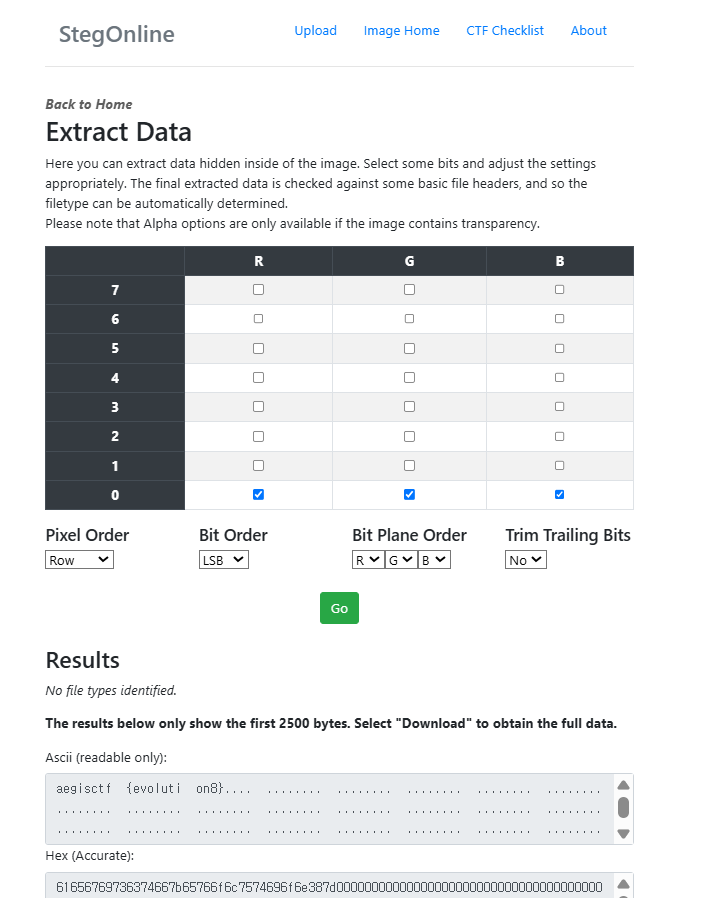

# Aegis CTF WriteUp

- Cute JJang9

→ CTF에서 자주 차용되는 아이디어 중 robots.txt로 접근시 flag를 뱉어주는 게 있고, 지난 헥테온에도 나왔었기 때문에 사용해보았다.

→ 참고로 로봇 짱구 아버님이 안 보이셔서 그냥 짱구 아버님 갖다 썼다;;

→ flag 값을 하드코딩해놨기 때문에 그냥 코드 안에서 찾는다.(출제 의도는 robots.txt로 도메인 접속하는 것인데, 언인텐이 발생한 거 같습니다.)

```jsx
<!-- robot_father/robots.txt -->
<!DOCTYPE html>
<html lang="en">
<head>
  <meta charset="UTF-8">
  <title>flag</title>
</head>
<body>
  <h2>aegisctf{shinnosuke}</h2>
</body>
</html>
```

```jsx
aegisctf{shinnosuke}
```

- Cute 2v2


→ **LSB 스테가노 그래피 기법**을 이용했다. 



Stegonline 기준으로(다른 LSB 스테가노 추출툴이어도 상관은 없음) RGB를 최하위값으로 설정한 뒤, LSB 비트 정렬로 설정후 Extract data를 실행해주면 ASCII 부분에서 플래그를 내뱉는다.

```jsx
aegisctf{evoulation8}
```